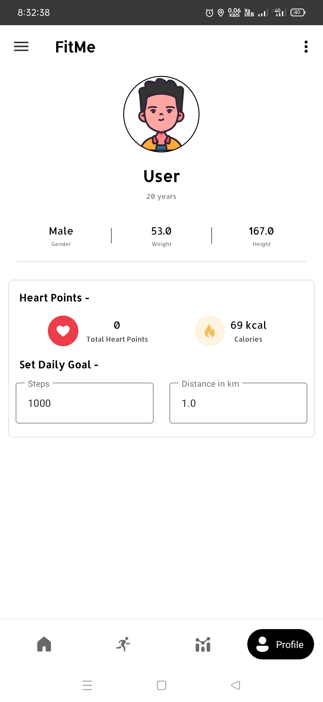

# FitMe App 

A Running Tracker App which tracks run or walk distance by using maps SDK and performs some tasks, show track routes on the maps, schedule things, shows articles by Android Jetpack Architecture. Tracks health of user by runs and calories burns and show user's statistics. 

## Acknowledgements

 - [Application](https://drive.google.com/file/d/1p6hjeiv-s0VnIPDIBnorvsG0JVkT6YKb/view)
 - [Project Screenshots](https://drive.google.com/drive/folders/1ux5hInwdHCKFBLXxt1ALX_d8Nsd6Sswo?usp=sharing)
 - [Project Prototype](https://drive.google.com/file/d/1v39jWIhYB0mf8neDXWUhti9UclUm3Hvc/view?usp=sharing)
 
## Screenshots

 
## Main Tech Stack

**Client:** Kotlin, SQLite(Room), Android Studio

**API's:** weatherapi, newsapi(for articles)

**SDK's:** Google MAP's SDK

## Other Dependencies and all

Dagger Hilt (Dependency Injection)

MVVM / MVP

ROOM Database

Retrofit / Navigation / Glide

Maps, charts and many dependencies
## License

[Apache License](https://github.com/thisisvd/FitMe-App/blob/master/LICENSE)

## Copyright

© 2021-2023 FitMe. All rights reserved.
