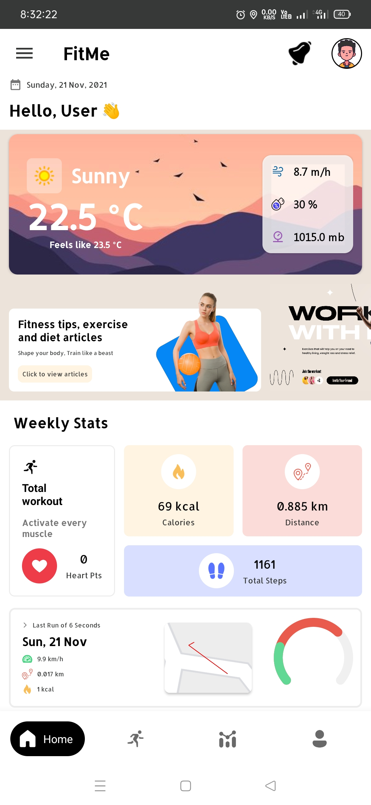
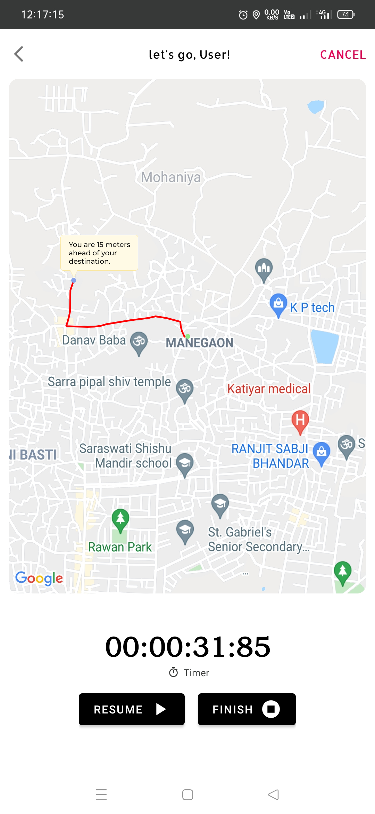
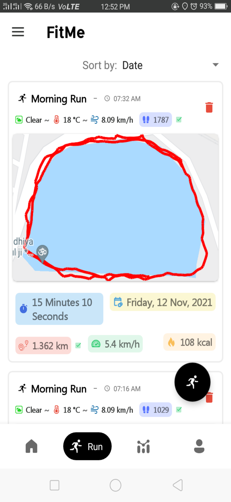
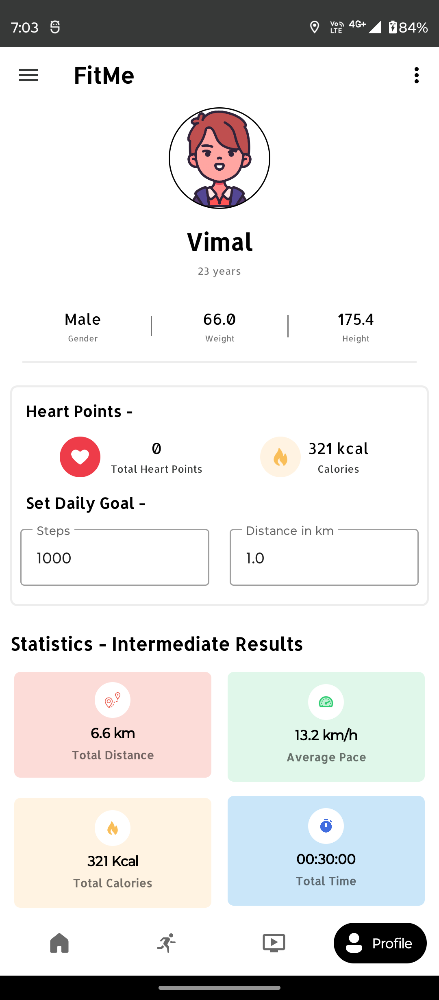
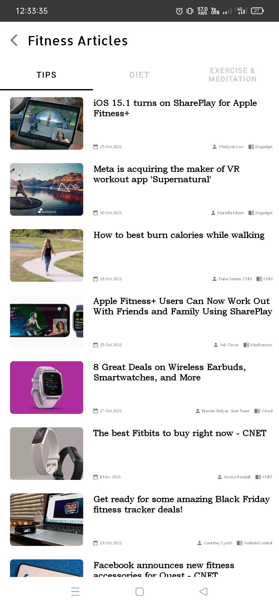
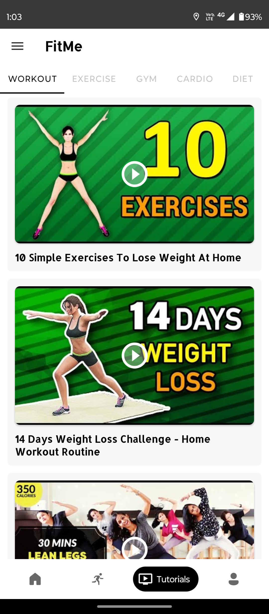
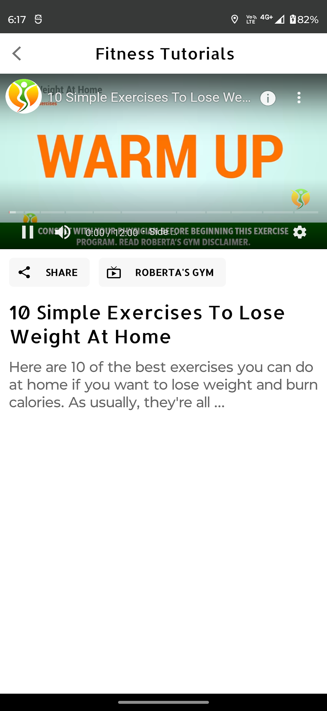

# FitMe App 

A Running Tracker App which tracks run or walk distance by using maps SDK and performs some tasks, show track routes on the maps, schedule things, shows articles by Android Jetpack Architecture. Tracks health of user by runs and calories burns and show user's statistics. 

**Features:** Track running track distance, steps, calories, and weather, provides diet plans, exercises, workout, and recommended youtube videos, setup alerts and goals for daily achievements, view statistics etc.

## Objective

The number of smartphone users has spread rapidly around the globe, along with this the use of Health and fitness apps has also increased because people prefer to track their fitness from their mobile rather than the traditional method of going and seeing a doctor. Several health and fitness apps in the market are loaded with tons of features, hat but these irrelevant features distract the user and also make the app complex to use, taking away the main purpose of the app. So keeping in mind all these factors we have developed a fitness app FITME which is user-friendly and easy to use and has a hassle-free experience t does not distract the users from their main goal.

## Acknowledgements

 - [Application](https://drive.google.com/file/d/1KeNVtiPkQBksGxHU_zHJmk3GxTdNlJGa/view?usp=share_link)
 - [Project Screenshots](https://drive.google.com/drive/folders/1ux5hInwdHCKFBLXxt1ALX_d8Nsd6Sswo?usp=share_link)
 - [Project Prototype](https://drive.google.com/file/d/1v39jWIhYB0mf8neDXWUhti9UclUm3Hvc/view?usp=sharing)
 - [Project](https://drive.google.com/drive/folders/1tmUjJbfLZajQUwAkBN9LgoJldlOtbSmC?usp=share_link)
 
## Screenshots

 
## Main Tech Stack

**Client:** Kotlin, SQLite(Room), Android Studio

**API's:** weatherapi, newsapi(for articles)

**SDK's:** Google MAP's SDK

## Other Dependencies and all

Dagger Hilt (Dependency Injection)

MVVM / MVP

ROOM Database

Retrofit / Navigation / Glide

Maps, charts and many dependencies
## License

[Apache License](https://github.com/thisisvd/FitMe-App/blob/master/LICENSE)

## Copyright

© 2021-2023 FitMe. All rights reserved.
