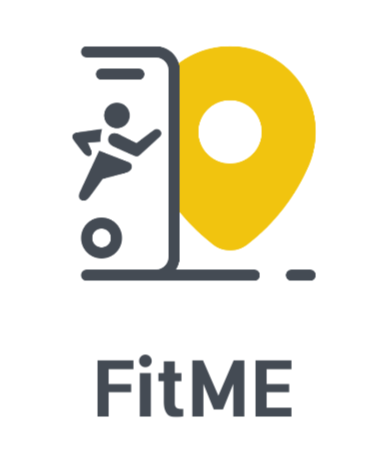

<h1 align="center">
  <br>
  
  <br>
 FitMe - Fitness Runner Tracker Application 
 <br>
</h1>

<h4 align="center">Download the latest android released application build.</h4>

<p align="center">
 <a href="https://drive.google.com/file/d/1Qho2jY1abDxGWi-FM-6BBqKymv_ZeShK/view?usp=drive_link">
    
 </a>
 <a href="https://github.com/thisisvd/FitMe-App/blob/master/support/application/Fitme-android-v1.3.6-b6-release.apk">
    
 </a>
</p>

<p align="center">
 <a href="#introduction">Introduction</a> •
 <a href="#objective-and-usage">Objective and Usage</a> •
 <a href="#screenshots">Screenshots</a> •
 <a href="#project-sources">Project Sources</a> •
 <a href="#how-to-use">How to use</a> •
 <a href="#tech-stack">Tech Stack</a> •
 <a href="#license">License</a>
</p>

## Introduction
FitME is a running tracker app that tracks run or walk distance using maps SDK. It performs some tasks, shows track routes on the maps, schedules things, and shows articles by Android Jetpack Architecture. Tracks the health of the user by runs and calorie burns and shows the user's statistics.

`Features:` Tracks running distance, steps, calories, and weather; provides diet plans, exercises, workouts, and recommended YouTube videos; sets up alerts and goals for daily achievements; view statistics, etc.

## Objective and Usage

The number of smartphone users has spread rapidly around the globe; along with this, the use of health and fitness apps has also increased because people prefer to track their fitness from their mobile rather than the traditional method of going and seeing a doctor. Several health and fitness apps on the market are loaded with tons of features, but these irrelevant features distract the user and also make the app complex to use, taking away the main purpose of the app. So keeping in mind all these factors, we have developed a fitness app, FITME, which is user-friendly and easy to use and has a hassle-free experience that does not distract the users from their main goal.

## Screenshots

<p float="left">


</p>

## Project Sources

 - [Application](https://drive.google.com/file/d/1Qho2jY1abDxGWi-FM-6BBqKymv_ZeShK/view?usp=drive_link)
 - [Project Screenshots](https://drive.google.com/drive/folders/1ux5hInwdHCKFBLXxt1ALX_d8Nsd6Sswo?usp=drive_link)
 - [Project Prototype](https://drive.google.com/file/d/1v39jWIhYB0mf8neDXWUhti9UclUm3Hvc/view?usp=sharing)
 - [Project](https://drive.google.com/drive/folders/1ZKiriA5bRr-G3z1bmTlYSgu9Y_uOAw9v?usp=sharing)

## How to use

  - Clone the project and run the application
```bash
git clone https://github.com/thisisvd/FitMe-App.git
```
  - Sync the project, build it and run it.
  - Then, in the `gradle.properties` file, obtain the keys from the relevant API sites and replace them below.
```bash
# API Key's
WEATHER_API_KEY="WEATHER_API_KEY"
GOOGLE_PLATFORM_API_KEY="GOOGLE_PLATFORM_API_KEY"
ARTICLES_API_KEY="ARTICLES_API_KEY"
CLIENT_ID_API_KEY="CLIENT_ID_API_KEY"
```
  - At last in `strings.xml` file replace `<string name="MAPS_API_KEY">MAPS_API_KEY</string>` with the original obtained maps api key.
 
## Tech Stack

`Client:` 


`API's:` [Weather-API](https://www.weatherapi.com), [News-API](https://newsapi.org/)

`SDK's:` [Google MAP's SDK](https://mapsplatform.google.com/)

## Other Dependencies and all

Dagger Hilt (for Dependency Injection), MVVM(Model-View-ViewModel), ROOM Database, Retrofit, Navigation, Glide, Maps, charts etc.

## License

This project is licensed under the [Apache License](https://github.com/thisisvd/FitMe-App/blob/master/LICENSE).

## Copyright

© 2021-2025 FitMe. All rights reserved.
